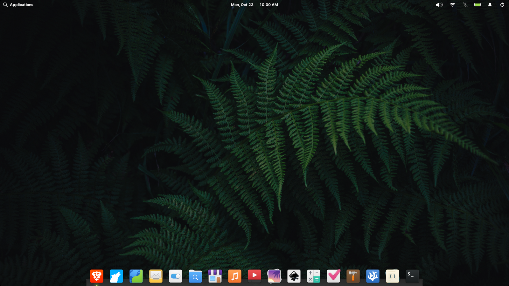

# ilementary

An icon theme for elementary OS 7+.



## Installation

To install the ilementary icon theme, run

```
bash <(wget -qO- https://raw.githubusercontent.com/i7zaari/ilementary/master/scripts/install.sh)
```

## Uninstallation

To uninstall the ilementary icon theme, run

```
bash <(wget -qO- https://raw.githubusercontent.com/i7zaari/ilementary/master/scripts/uninstall.sh)
```